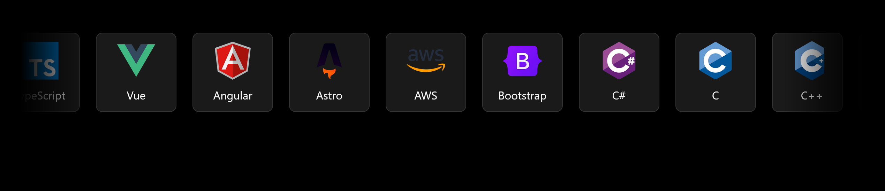

# Infinite Marquee



## Instalación

Sigue estos pasos para configurar el proyecto:

1. **Clonar el repositorio:**
   ```bash
   git clone https://github.com/tu-usuario/tu-repo.git
   ```
   Cambia tu-usuario y tu-repo por el usuario y nombre de tu repositorio.


   Instalar dependencias: Desde el directorio del proyecto:
    ```bash
   cd tu-repo
   npm install
    ```
    Esto instalará todas las dependencias necesarias.


   Iniciar el servidor de desarrollo:
    ```bash
   npm run dev
   ```
    Luego, abre http://localhost:5173 en tu navegador para ver la aplicación en funcionamiento.


